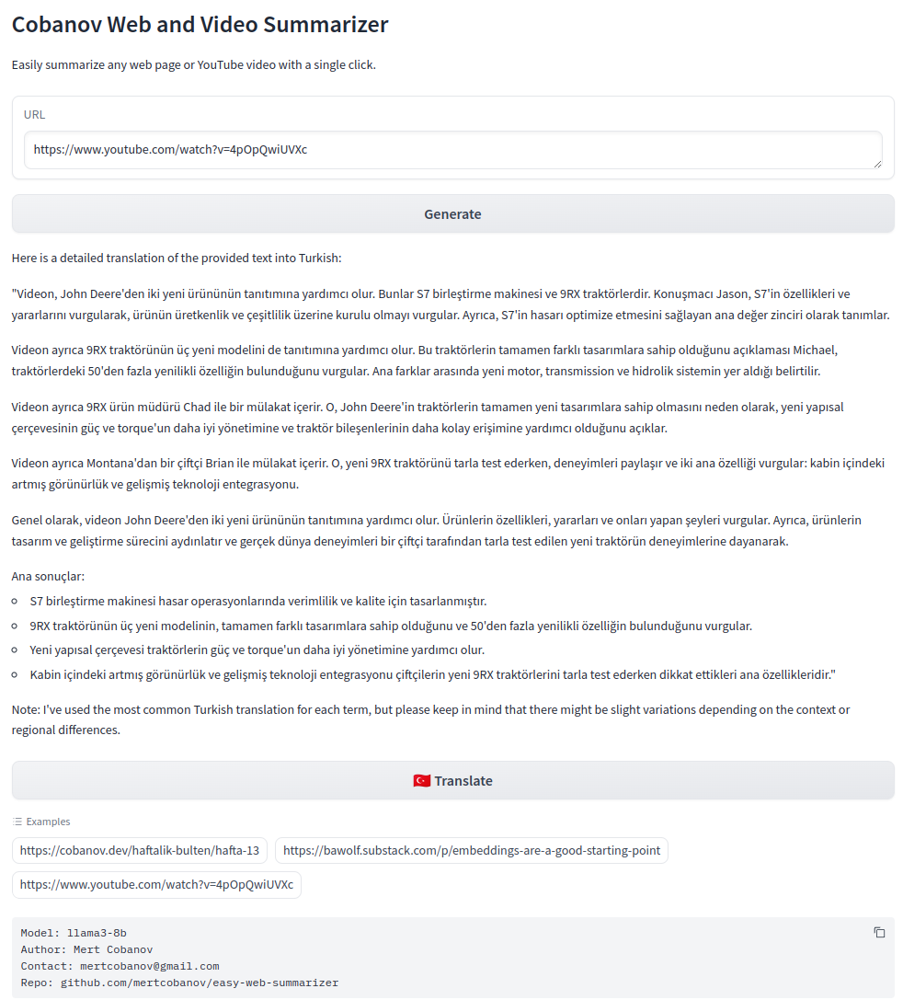

# web-summarizer-using-langchain

A Python Project designed to summarize webpages from given URLs using the LangChain framework and the ChatOllama model. This tool utilizes advanced language models to produce detailed summaries, making it highly valuable for quickly grasping the content of online documents.

## Requirements

[ollama](https://ollama.com/) must be installed and served

```bash
ollama run llama3:instruct
```

```bash
pip install -r requirements.txt
```

## Features

- Summarization of webpages and youtube videos directly from URLs.
- Translates to Turkish language (other languages will be added soon!)
- Integration with LangChain and ChatOllama for state-of-the-art summarization.
- Command-line interface for easy use and integration into workflows.

## Usage

To use the webpage summarizer, run the script from the command line, providing the URL of the document you wish to summarize:

```bash
python summarizer.py -u "http://example.com/document"
```

Replace `http://example.com/document` with the actual URL of the document you want to summarize.

### Web UI

To use the webpage summarizer in you web browser, you can also try gradio app.

```bash
python app/webui.py
```



## Docker

```bash
docker build -t web_summarizer .
docker run -p 7860:7860 web_summarizer

# Run if you run ollama on host
docker run -d --network='host' -p 7860:7860 web_summarizer
```


## License

This script is released under the MIT License. See the [LICENSE](./LICENSE) file in the repository for full details.
